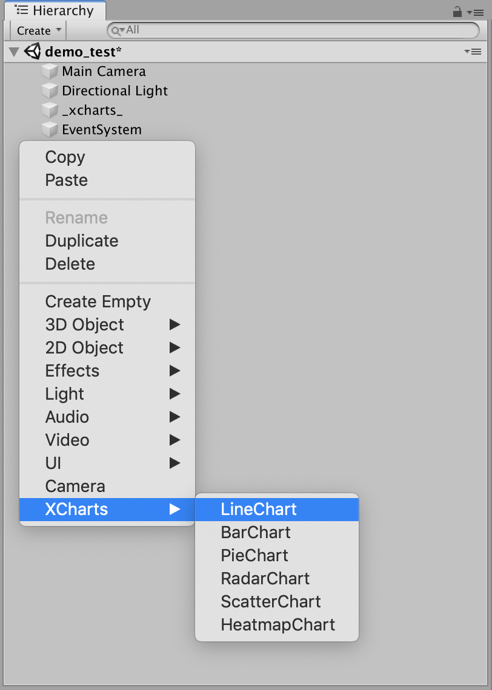

# Get start with XCharts in 5 minute

[Return homepage](https://github.com/monitor1394/unity-ugui-XCharts)  
[XCharts Q&A](https://github.com/monitor1394/unity-ugui-XCharts/blob/master/Assets/XCharts/Documentation/xcharts-questions-and-answers-EN.md)  
[XCharts API](https://github.com/monitor1394/unity-ugui-XCharts/blob/master/Assets/XCharts/Documentation/xcharts-api-EN.md)  
[XCharts Configuration](https://github.com/monitor1394/unity-ugui-XCharts/blob/master/Assets/XCharts/Documentation/xcharts-configuration-EN.md)

## Installing XCharts

Install `XCharts` using one of the following methods:

If you just want to run demo and know what does `XCharts` look like, you can download the project in [Github](https://github.com/monitor1394/unity-ugui-XCharts),[master](https://github.com/monitor1394/unity-ugui-XCharts/archive/master.zip) is the latest unstable version, [release](https://github.com/monitor1394/unity-ugui-XCharts/releases) provide stable versions to download. Open with Unity if downloaded.

If you want to join `XCharts` to your project, you can download the unitypackage from [release](https://github.com/monitor1394/unity-ugui-XCharts/releases). XCharts include two unitypackage: `XCharts` and `XChartsDemo`. Import the `XCharts.unitypackage` to your project. `XChartsDemo.unitypackage` is the packge of Demo, you can import it as you see fit. Also, you can download the source code and copy to your project.

If your project use `Unity 2018.3` or above, your can import `XCharts` by `Package Manager`, which only contain `XCharts` core and do not include the `XChartsDemo`. The specific steps are as follows:

1. Open the `mamnifest.json` file in `Packages` directory, and add:
``` json
    "com.monitor1394.xcharts": "https://github.com/monitor1394/unity-ugui-XCharts.git#package",
```
2. Switch to `Unity`, It may take 3 to 5 minutes to download and compile, and once successful you can start using `XCharts`.
3. If you want to delete `XCharts`, undo step 1.
4. If you want to update `XCharts`, delete the contents about `com.monitor1394.xcharts` under `lock` of `manifest.json` file, it will be download and compile again.
5. You can check update in `Component -> XCharts -> Check For Update`.

## Add a simple LineChart

In `Hierarchy` attempt to right click or menu bar `GameObject` drop down: `XCharts-> LineChart`



A simple line chart is done:


You can adjust the parameters of each component in `Inspector` view, and `Game` view will fed back the effect of adjustment in real time. [XCharts Configuration](xcharts-configuration-EN.md) can see the detailed descriptions of each component parameters.


## How to adjust parameters quickly

* The first thing to understand is that `XCharts` is drived by configuration parameter. To get the desired effect, you only need to adjust the configuration parameters under the corresponding component. There is no need to change the nodes attempted by `Hierarchy`, because those nodes are generated internally by `XCharts` according to the configuration parameters. If you change it, it will be restored.

* Quickly locate the component that corresponds to the effect you want to change. This requires some understanding of the components. For example, we want the end of axis X to display arrows, step 1, axis X map to `XAxis0`. step 2, axis line map to `AxisLine`, and then see if `AxisLine` has any parameters to achieve this effect.

* `XCharts` provides a full range of parameter configurations from global `Theme`, series `Serie`, individual data items `SerieData`. Priority from large to small: `SerieData` -> `Serie` -> `Theme`. Take the color example of `ItemStyle`, which is preferred if `ItemStyle` of `SerieData` is configured with a color value. To determine if the Color value is configured is `Color. clear` (the Color RGBA is 0).

## Add LineChart with code

Add component `LineChart` to gameObject:

```C#
var chart = gameObject.GetComponent<LineChart>();
if (chart == null)
{
    chart = gameObject.AddComponent<LineChart>();
}
```

Set the title:

```C#
chart.title.show = true;
chart.title.text = "Line Simple";
```

Set the tooltip and legend:

```C#
chart.tooltip.show = true;
chart.legend.show = false;
```

Sets whether to use double axes and the type of axes:

```C#
chart.xAxes[0].show = true;
chart.xAxes[1].show = false;
chart.yAxes[0].show = true;
chart.yAxes[1].show = false;
chart.xAxes[0].type = Axis.AxisType.Category;
chart.yAxes[0].type = Axis.AxisType.Value;
```

Set the dividing line of coordinate axis:

```C#
chart.xAxes[0].splitNumber = 10;
chart.xAxes[0].boundaryGap = true;
```

Clear data, add 'Serie' of type 'Line' to receive the data:

```C#
chart.RemoveData();
chart.AddSerie(SerieType.Line);
```

Add 10 data:

```C#
for (int i = 0; i < 10; i++)
{
    chart.AddXAxisData("x" + i);
    chart.AddData(0, Random.Range(10, 20));
}
```

And then here is a simple line chart:


If there are more than one series in a chart, the Axis data only needs to be added once, instead of repeating multiple loops. Remember: Axis needs to have the same number of data from Serie.

See the complete code in `Examples`：`Example13_LineSimple.cs`  

You can also use the code to control more parameters. There are many more examples under `Examples`. All parameters in [XCharts Configuration](xcharts-configuration-EN.md) or `Inspector` can be controlled by code.

In addition, unless customized, it is recommended to call the interfaces in the [XCharts API](https://github.com/monitor1394/unity-ugui-XCharts/blob/master/Assets/XCharts/Documentation/xcharts-api-EN.md), which do some internal correlation processing, such as refreshing the chart, etc. If you call the interface of an internal component, you'll need to handle other issues like refresh yourself.

[Return homepage](https://github.com/monitor1394/unity-ugui-XCharts)  
[XCharts Q&A](https://github.com/monitor1394/unity-ugui-XCharts/blob/master/Assets/XCharts/Documentation/xcharts-questions-and-answers-EN.md)  
[XCharts API](https://github.com/monitor1394/unity-ugui-XCharts/blob/master/Assets/XCharts/Documentation/xcharts-api-EN.md)  
[XCharts Configuration](https://github.com/monitor1394/unity-ugui-XCharts/blob/master/Assets/XCharts/Documentation/xcharts-configuration-EN.md)
