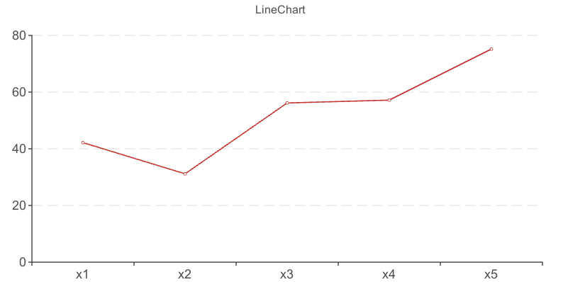
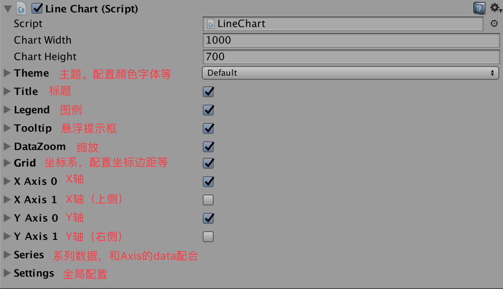
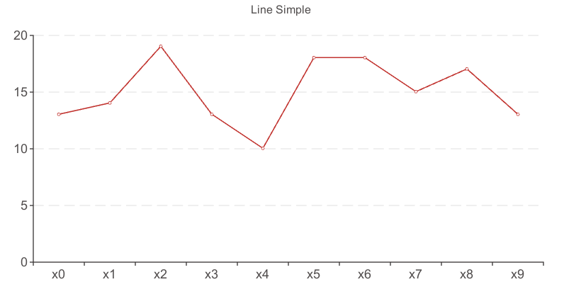

# 教程：5分钟上手XCharts

[返回首页](https://github.com/monitor1394/unity-ugui-XCharts)  
[XChartsAPI接口](XChartsAPI.md)  
[XCharts配置项手册](XCharts配置项手册.md)

## 获取和引入 XCharts

---

你可以通过以下两种方式获取 `XCharts` 。

如果你只是想运行 `Demo` 查看效果，可以在 [Github](https://github.com/monitor1394/unity-ugui-XCharts)上的 [Clone or download](https://github.com/monitor1394/unity-ugui-XCharts/archive/master.zip)下载最新版本或去 [release](https://github.com/monitor1394/unity-ugui-XCharts/releases)下载稳定版本，将源码工程解压后用`unity`打开即可。

 如果你要将 `XCharts` 加入你的项目中，可以在[Github](https://github.com/monitor1394/unity-ugui-XCharts)上下载最新的 [release](https://github.com/monitor1394/unity-ugui-XCharts/releases)稳定版本，将 `XCharts-vx.x.x.unitypackage` 通过 Unity 导入到你的项目中，或下载 Source code 解压后将内部的 `XCharts` 文件夹拷贝到你项目的 `Assets` 目录下。

## 添加一个简单图表

---

新建场景或在已有场景的 `Canvas` 下添加一个名为 `line_chart` 的 `GameObject`。  

选中 `line_chart`，通过菜单栏 `Component->XCharts->LineChart` 或者  `Inspector` 视图的 `Add Component` 添加 `LineChart` 脚本。设置 `line_chart` 的尺寸，一个简单的折线图就出来了。

在 `Inspector` 视图下可以调整各个组件的参数，`Game` 视图会实时反馈调整的效果。各个组件的详细参数说明可查阅[XCharts配置项手册](XCharts配置项手册.md)。


## 用代码添加折线图

---

给`gameObject`挂上`LineChart`脚本：

```C#
var chart = gameObject.GetComponent<LineChart>();
if (chart == null)
{
    chart = gameObject.AddComponent<LineChart>();
}
```

设置标题：

```C#
chart.title.show = true;
chart.title.text = "Line Simple";
```

设置提示框和图例是否显示：

```C#
chart.tooltip.show = true;
chart.legend.show = false;
```

设置是否使用双坐标轴和坐标轴类型：

```C#
chart.xAxises[0].show = true;
chart.xAxises[1].show = false;
chart.yAxises[0].show = true;
chart.yAxises[1].show = false;
chart.xAxises[0].type = Axis.AxisType.Category;
chart.yAxises[0].type = Axis.AxisType.Value;
```

设置坐标轴分割线：

```C#
chart.xAxises[0].splitNumber = 10;
chart.xAxises[0].boundaryGap = true;
```

清空数据，添加`Line`类型的`Serie`用于接收数据：

```C#
chart.RemoveData();
chart.AddSerie(SerieType.Line);
```

添加10个数据：

```C#
for (int i = 0; i < 10; i++)
{
    chart.AddXAxisData("x" + i);
    chart.AddData(0, Random.Range(10, 20));
}
```

这样一个简单的折线图就出来了：


完整代码请查阅`Demo`：`Demo10_LineSimple.cs`  
你还可以用代码控制更多的参数，[XCharts配置项手册](XCharts配置项手册.md)里面的所有参数都是可以通过代码控制的。


[返回首页](https://github.com/monitor1394/unity-ugui-XCharts)  
[XChartsAPI接口](XChartsAPI.md)  
[XCharts配置项手册](XCharts配置项手册.md)
